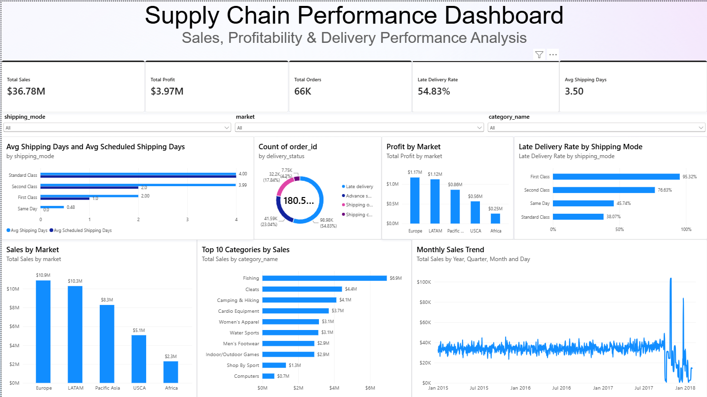

# Supply Chain Performance Analytics

## Project Overview

This project analyzes supply chain, sales, profitability, and delivery performance using a dataset containing over **180,000 transaction records**.

The goal was to transform raw supply chain data into actionable business insights by using **Python for data cleaning and analysis, SQLite and SQL for business queries, and Power BI for interactive visualization**.

The analysis focuses on identifying delivery inefficiencies, shipping performance, sales trends, profitable markets, product categories, and areas where operational performance could be improved.

---

## 📊 Power BI Dashboard



The interactive Power BI dashboard allows users to filter results by **market, shipping mode, and product category**.

### Dashboard KPIs

- **Total Sales:** $36.78M
- **Total Profit:** $3.97M
- **Total Orders:** 65,752
- **Late Delivery Rate:** 54.83%
- **Average Shipping Time:** 3.50 days

---

## 🔍 Key Business Insights

### Delivery Performance

The overall **late delivery rate was 54.83%**, indicating a significant delivery-performance challenge.

Shipping mode analysis showed:

| Shipping Mode | Late Delivery Rate |
|---|---:|
| First Class | 95.32% |
| Second Class | 76.63% |
| Same Day | 45.74% |
| Standard Class | 38.07% |

First Class had the highest observed late-delivery rate despite being a premium shipping option, making shipping-mode performance an important area for further operational investigation.

### Market Performance

Europe generated the highest overall sales:

| Market | Sales | Profit |
|---|---:|---:|
| Europe | $10.87M | $1.17M |
| LATAM | $10.28M | $1.12M |
| Pacific Asia | $8.27M | $0.86M |
| USCA | $5.07M | $0.56M |
| Africa | $2.29M | $0.25M |

### Product Category Performance

The highest-selling categories included:

1. Fishing — **$6.93M**
2. Cleats — **$4.43M**
3. Camping & Hiking — **$4.12M**
4. Cardio Equipment — **$3.69M**
5. Women's Apparel — **$3.15M**

The analysis also identified products with negative aggregate profit, providing potential areas for further pricing, discount, and product-performance investigation.

---

## 🛠️ Tools & Technologies

- **Python**
  - pandas
  - Data cleaning
  - Exploratory data analysis
  - KPI calculations
- **SQL**
  - Aggregations
  - GROUP BY analysis
  - Business KPI queries
  - Product, market, and regional analysis
- **SQLite**
  - Local analytical database
  - 180,519 records loaded for SQL analysis
- **Power BI**
  - DAX measures
  - KPI cards
  - Interactive slicers
  - Delivery analysis
  - Sales and profitability visualization
- **GitHub**
  - Project documentation
  - Version-controlled analysis scripts

---

## 🔄 Project Workflow

```text
Raw Supply Chain Dataset
          ↓
Python Data Exploration
          ↓
Data Cleaning & Transformation
          ↓
Cleaned Dataset
          ↓
SQLite Database
          ↓
SQL Business Analysis
          ↓
Power BI Dashboard
          ↓
Business Insights
```

---

## 🧹 Data Cleaning

The original dataset contained:

- **180,519 rows**
- **53 columns**

The cleaning process included:

- Identifying missing values
- Checking duplicate records
- Removing a completely empty `Product Description` field
- Removing the mostly incomplete `Order Zipcode` field
- Handling small amounts of missing customer information
- Converting order and shipping fields to datetime
- Standardizing column names for Python and SQL analysis
- Preserving the original raw dataset separately from processed data

The final analytical dataset contained:

- **180,519 rows**
- **51 columns**
- **0 duplicate rows**
- **0 remaining missing values**

---

## 🗄️ SQL Analysis

SQL was used to answer business questions including:

- How many unique orders were processed?
- What were total sales and profit?
- What percentage of deliveries were late?
- Which shipping modes experienced the highest late-delivery rates?
- Which categories generated the most sales?
- Which markets generated the most sales and profit?
- Which products generated the most profit?
- Which products generated aggregate losses?
- Which geographic regions generated the most sales?

---

## 📁 Repository Structure

```text
supply-chain-performance-analytics/
│
├── dashboard/
│   └── Supply_Chain_Analytics_Dashboard.pbix
│
├── images/
│   └── supply_chain_dashboard.png
│
├── notebooks/
│   ├── 01_data_exploration.py
│   ├── 02_data_cleaning.py
│   ├── 03_supply_chain_analysis.py
│   ├── 04_create_database.py
│   └── 05_run_sql_analysis.py
│
├── sql/
│   └── 01_supply_chain_analysis.sql
│
├── .gitignore
└── README.md
```

---

## 📈 Business Value

This project demonstrates how supply chain data can be transformed into decision-support information by combining multiple analytics tools.

The analysis highlights opportunities to:

- Investigate high late-delivery rates
- Compare actual versus scheduled shipping performance
- Identify high-performing markets and categories
- Detect loss-making products
- Monitor sales and profitability
- Support operational and logistics decision-making

---

## Skills Demonstrated

**Python • Pandas • Data Cleaning • Exploratory Data Analysis • SQL • SQLite • DAX • Power BI • Data Visualization • Supply Chain Analytics • Business Analytics**
